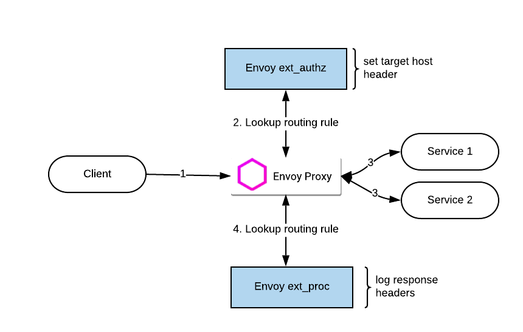

# envoy-router

This repo demonstrates how to use Envoy's [External Authorization](https://www.envoyproxy.io/docs/envoy/latest/configuration/http/http_filters/ext_authz_filter) aka `ext_authz`  and [External Processing](https://www.envoyproxy.io/docs/envoy/latest/configuration/http/http_filters/ext_proc_filter) aka `ext_proc` filters

At the time of writing repo, the ext_proc filter was marked as work-in-progress. Most of the major bits of functionality are complete.

## Envoy Version

This repo was tested with Envoy version

```sh
envoy  version: c919bdec19d79e97f4f56e4095706f8e6a383f1c/1.22.2/Modified/RELEASE/BoringSSL
```

## Sample Use Case



1. Client application sends a http request to Envoy
2. Envoy is configured to call an `ext_authz` service. `ext_authz` service looks up a routing table to match the incoming request to a backend server. Despite using the `ext_authz` filter, no authorization is performed
3. Envoy routes the http call to a backend (upstream) service. If the routing table has upstream authentication configured, then `ext_auth` will generate a token and add (or replace) the `authorization` header
4. Envoy can be configured to call an `ext_proc` service. `ext_proc` service inspects the response status from the upstream service and adds an http header if the call was successful.

NOTES:
a. Using an external routing service is useful only when one requires a heavily custom routing logic (ex: inspecting parts of the payload)

This repo relies on three Envoy HTTP filters:

* [External Authorization](https://www.envoyproxy.io/docs/envoy/latest/configuration/http/http_filters/ext_authz_filter) filter
* [External Processing](https://www.envoyproxy.io/docs/envoy/latest/configuration/http/http_filters/ext_proc_filter) filter
* [Dynamic Forward Proxy](https://www.envoyproxy.io/docs/envoy/latest/configuration/http/http_filters/dynamic_forward_proxy_filter) filter

## Routing Table

This example of a routing table uses the incoming http path and matches it with the routing table stored as a json file. From that table, the backend/upstream service is picked up.  

```json
{
    "routerules" : [
      {
        "name": "mocktarget",
        "prefix": "/iloveapis",
        "backend": "mocktarget.apigee.net",
        "authentication": 0
      }   
    ]
}
```

### Authentication

There are three authentication profiles supported:

* OFF = `0`: Do nothing, if an auth header is passed by the client, it is preserved
* ACCESS_TOKEN = `1`: Uses a google service account, obtains an access token (every 25 mins)
* OIDC_TOKEN = `2`: [TBD] Generates a Google OIDC token  

The prefix is removed from the request from sending to the upstream service

Client sends `HTTP GET /iloveapi/user` to Envoy. This matches an entry to the routing table. The `ext_authz` service will send `/user` to `mocktarget.apigee.net`.

___

## Support

This is not an officially supported Google product
